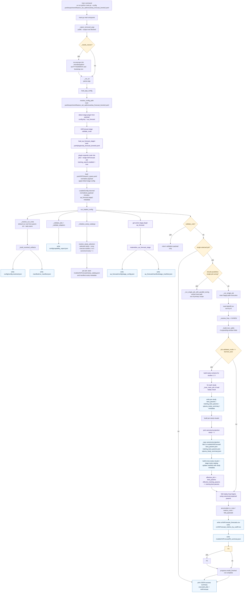

# AA-Forecast BrentOil runtime flow

## Scope
This document explains the **actual happy-path runtime orchestration** when running:

- entrypoint: `main.py`
- config: `yaml/experiment/feature_set_aaforecast/aa_forecast_brentoil.yaml`

It focuses on **runtime orchestration, file/function boundaries, data handoffs, study/fold flow, and produced artifacts**.

## Out of scope
- AAForecast internal math / layer architecture / algorithm derivation
- validate-only-only branch details as a primary execution path
- single-job parallel-tuning worker internals
- error/exception branches

## Verified runtime facts for this exact config

| Item | Verified value |
|---|---|
| task.name | `aa_forecast_brentoil` |
| dataset path | `data/df.csv` |
| target | `Com_BrentCrudeOil` |
| inferred frequency | `W-MON` |
| total rows | `584` |
| stage plugin | `aa_forecast` |
| linked plugin config | `yaml/plugins/aa_forecast_brentoil.yaml` |
| selected job | `AAForecast` |
| job validated mode | `learned_auto` |
| training search mode | `training_auto` |
| runtime opt_n_trial | `100` |
| runtime opt_study_count | `5` |
| canonical projection study | `1` |
| execute study indices | `[1, 2, 3, 4, 5]` |
| CV policy | `horizon=4`, `step_size=6`, `n_windows=4` |
| uncertainty | enabled, `sample_count=50` |
| run root | `runs/feature_set_aaforecast_aa_forecast_brentoil` |

## Source / artifact provenance map

| Concern | Main code path | Main artifacts |
|---|---|---|
| entrypoint / bootstrap | `main.py` | none directly |
| config resolution | `app_config.py::load_app_config(...)` | `config/config.resolved.json` |
| job capability report | `runtime_support/runner.py::_validate_jobs(...)` | `config/capability_report.json` |
| run manifest | `runtime_support/runner.py::_build_resolved_artifacts(...)` + `_update_manifest_artifacts(...)` | `manifest/run_manifest.json` |
| aa_forecast stage metadata | `plugins/aa_forecast/runtime.py::materialize_aa_forecast_stage(...)` | `aa_forecast/config/stage_config.json`, `aa_forecast/manifest/stage_manifest.json` |
| study catalog / projection | `runtime_support/runner.py::_run_single_job(...)` | `models/AAForecast/study_catalog.json`, `best_params.json`, `training_best_params.json`, `optuna_study_summary.json` |
| fold predictions / metrics | `runtime_support/runner.py::_run_single_job(...)` + `plugins/aa_forecast/runtime.py::predict_aa_forecast_fold(...)` | `cv/AAForecast_forecasts.csv`, `cv/AAForecast_metrics_by_cutoff.csv` |
| uncertainty artifacts | `plugins/aa_forecast/runtime.py::_write_uncertainty_artifacts(...)` | `aa_forecast/uncertainty/*.json`, `aa_forecast/uncertainty/*.csv` |
| final fit summary | `runtime_support/runner.py::_run_single_job(...)` | `models/AAForecast/fit_summary.json` |

## Mermaid 1 — top-level orchestration



## Mermaid 2 — fold-internal execution

```mermaid
flowchart TD
    R0[_run_single_job]
    R1[source_df = read CSV\nsort by dt]
    R2[splits from build TSCV splits]
    R3[for each fold index train slice and test slice]
    R4[progress fold started phase replay]
    R5[fit and predict fold]

    subgraph FoldSetup[Fold data setup in runner]
        FS1[derive train_df and future_df from source slices]
        FS2[pass run_root because active stage plugin exists]
        FS3[delegate to stage plugin fold path]
    end

    subgraph AAFold[plugins/aa_forecast/runtime.py::predict_aa_forecast_fold(...)]
        AA1[concat train_df and future_df]
        AA2[resolve frequency from fold source data]
        AA3[derive effective config with training override]
        AA4[build fold diff context]
        AA5[transform training frame]
        AA6[build adapter inputs]
        AA7[build model with AA overrides]
        AA8[optional STAR precompute context]
        AA9[NeuralForecast instance single model]
        AA10[NeuralForecast.fit(...)]
        AA11[predict with adapter via nf.predict]
        AA12[extract target prediction frame]
        AA13{uncertainty.enabled?}
        AA14[select uncertainty predictions]
        AA15[repeat stochastic predictions for each dropout candidate]
        AA16[select min-std dropout per horizon step]
        AA17[write uncertainty artifacts]
        AA18[extract target actuals from future_df]
        AA19[return predictions actuals train_end train_df nf]
    end

    subgraph FoldBackInRunner[Back in runtime_support/runner.py]
        FR1[compute metrics]
        FR2[append forecast rows into cv_rows]
        FR3[append cutoff metrics into metrics_rows]
        FR5[progress fold completed]
        FR6{exception raised?}
        FR7[progress error]
        FR8[raise / fail run]
    end

    R0 --> R1 --> R2 --> R3 --> R4 --> R5
    R5 --> FS1 --> FS2 --> FS3 --> AA1 --> AA2 --> AA3 --> AA4 --> AA5 --> AA6 --> AA7 --> AA8 --> AA9 --> AA10 --> AA11 --> AA12 --> AA13
    AA13 -- yes --> AA14 --> AA15 --> AA16 --> AA17 --> AA18 --> AA19
    AA13 -- no --> AA18 --> AA19
    AA19 --> FR1 --> FR2 --> FR3 --> FR4 --> FR5 --> R3
    R5 --> FR6
    FR6 -- yes --> FR7 --> FR8
    FR6 -- no --> FS1

    subgraph Finalization[After all folds]
        Z1[write cv/AAForecast_forecasts.csv]
        Z2[write cv/AAForecast_metrics_by_cutoff.csv]
        Z3[write models/AAForecast/fit_summary.json]
        Z6[progress model finished run complete]
    end

    R3 --> Z1 --> Z2 --> Z3 --> Z4
    Z4 -- false --> Z5 --> Z6
    Z4 -- true --> Z6

    classDef artifact fill:#eef7ff,stroke:#1d70b8,color:#0b2540;
    classDef decision fill:#fff4db,stroke:#a36a00,color:#4d3400;
    classDef phase fill:#f6fff2,stroke:#4f8a10,color:#143800;
    class AA13,FR6,Z4 decision;
    class AA17,Z1,Z2,Z3 artifact;
    class FoldSetup,AAFold,FoldBackInRunner,Finalization phase;
```

## Verified fold windows

| Fold | Train range | Test range | Train rows | Test rows |
|---:|---|---|---:|---:|
| 0 | `2015-01-05 -> 2025-10-06` | `2025-10-13 -> 2025-11-03` | 562 | 4 |
| 1 | `2015-01-05 -> 2025-11-17` | `2025-11-24 -> 2025-12-15` | 568 | 4 |
| 2 | `2015-01-05 -> 2025-12-29` | `2026-01-05 -> 2026-01-26` | 574 | 4 |
| 3 | `2015-01-05 -> 2026-02-09` | `2026-02-16 -> 2026-03-09` | 580 | 4 |

## Notes on what the diagrams intentionally abstract
- The top-level diagram shows **abstract study fan-out** (`studies 1..5`) and **canonical replay** (`study 1`) without expanding every helper beneath `_tune_main_job(...)`.
- The fold diagram shows the **runtime handoff boundaries** and the main data/artifact flow, not every helper used to construct `backcast_panel` or every column written to CSV.
- `validate_only` and worker-internal parallel tuning exist in code, but they are not the primary runtime path documented here.

## Verification commands used for this document
- `UV_CACHE_DIR=/tmp/uv-cache uv run python main.py --validate-only --config yaml/experiment/feature_set_aaforecast/aa_forecast_brentoil.yaml`
- `UV_CACHE_DIR=/tmp/uv-cache uv run python - <<'PY' ... load_app_config(...) / _resolve_run_roots(...) ... PY`
- `UV_CACHE_DIR=/tmp/uv-cache uv run python - <<'PY' ... _build_tscv_splits(...) / _resolve_freq(...) ... PY`
- `UV_CACHE_DIR=/tmp/uv-cache uv run python - <<'PY' ... resolve_study_selection(...) ... PY`
