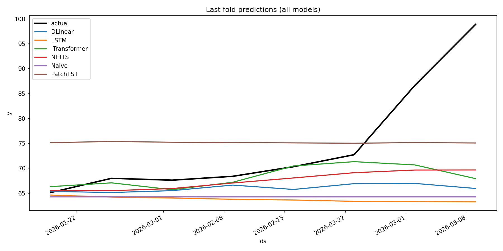
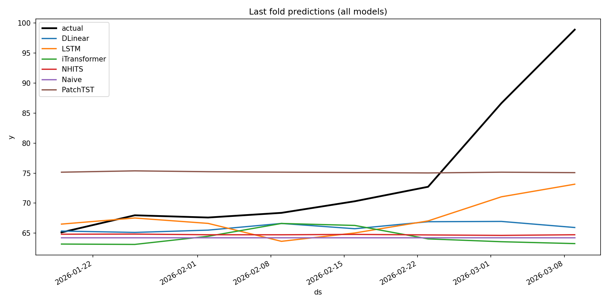
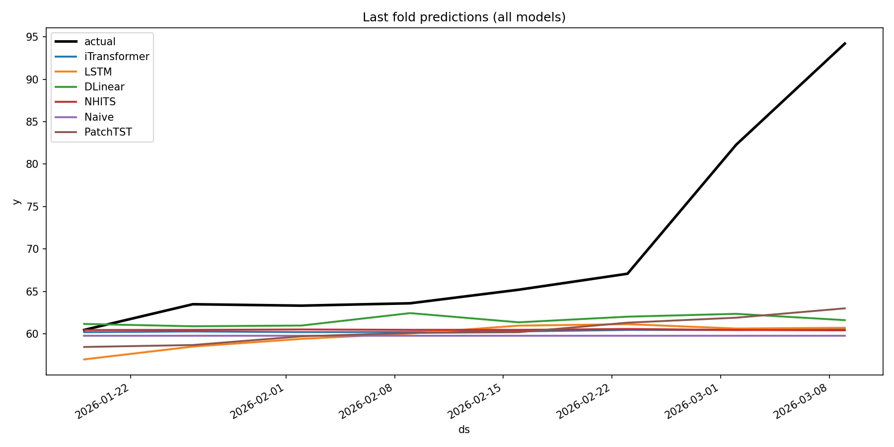
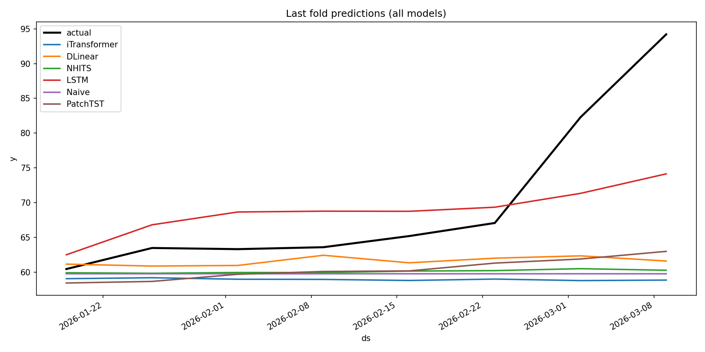

# 01. 핵심쟁점

---

- “기본모델(Benchmark)”과 “실험모델(OOO방법론 적용)”을 비교했을 때, 성능 향상이 있는지 확인한다.
- 네 개의 HPT case를 하나의 보고서 흐름으로 정리하되, case별 결과 차이는 유지한다.
- 마지막 appendix에는 각 case의 모든 모델 하이퍼파라미터를 붙인다.

# 02. 데이터 및 모델 세팅

---

- **예측 타깃:** WTI / Brent Oil (F) Weekly Avg
- **예측 단위:** 주간 예측
- **데이터 구간 세팅:**
    - TrainSet 기간: 2000-00-00 ~ 2000-00-00 (총 00주)
    - ValidationSet 기간: 2000-00-00 ~ 2000-00-00 (총 n개 Fold)
        - Cross-Validation Fold 1: 2000-00-00 ~ 2000-00-00 (총 00주)
        - Cross-Validation Fold 2: 2000-00-00 ~ 2000-00-00 (총 00주)
        - Cross-Validation Fold 3: 2000-00-00 ~ 2000-00-00 (총 00주)
        - …
        - Cross-Validation Fold n: 2000-00-00 ~ 2000-00-00 (총 00주)
    - TestSet 기간: 2000-00-00 ~ 2000-00-00 (총 00주)
    - 평가는 5개 rolling TSCV(h=8, step=8) 구조로 설계

## **Case 1 HPT | BrentCrude**

```yaml
...
hist_exog_cols:
  - Com_Gasoline
  - Com_Steel
  - Bonds_US_Spread_10Y_1Y
  - Bonds_CHN_Spread_30Y_5Y
  - EX_USD_BRL
  - Com_Cheese
  - Bonds_BRZ_Spread_10Y_1Y
  - Com_Cu_Gold_Ratio
  - Idx_OVX
  - Com_Oil_Spread
  - Com_LME_Zn_Spread
  - Idx_CSI300
  - Bonds_CHN_Spread_5Y_1Y
  - Com_LME_Cu_Spread
  - Com_LME_Pb_Spread
  - Com_LME_Al_Spread
...
```

## **Case 2 HPT | BrentCrude**

```yaml
...
hist_exog_cols:
  - Com_Gasoline
  - Com_BloombergCommodity_BCOM
  - Com_LME_Ni_Cash
  - Com_Coal
  - Com_Cotton
  - Com_LME_Al_Cash
  - Bonds_KOR_10Y
  - Com_Barley
  - Com_Canola
  - Com_LMEX
  - Com_LME_Ni_Inv
  - Com_Corn
  - Com_Wheat
...
```

## **Case 1 HPT | WTI**

```yaml
...
hist_exog_cols:
  - Com_Gasoline
  - Com_LME_Zn_Inv
  - Com_OrangeJuice
  - Com_Cheese
  - Bonds_BRZ_1Y
  - Idx_OVX
  - Com_Cu_Gold_Ratio
  - Com_LME_Sn_Inv
  - Idx_CSI300
  - Com_LME_Zn_Spread
  - Bonds_CHN_Spread_5Y_2Y
  - Com_LME_Al_Spread
  - Bonds_CHN_Spread_2Y_1Y
  - Com_Oil_Spread
  - Bonds_CHN_Spread_10Y_5Y
...
```

## **Case 2 HPT | WTI**

```yaml
...
hist_exog_cols:
  - Com_Gasoline
  - Com_BloombergCommodity_BCOM
  - Com_LME_Ni_Cash
  - Com_Coal
  - Com_Canola
  - Com_Cotton
  - Com_LME_Al_Cash
  - Com_LMEX
  - Bonds_KOR_10Y
  - Com_PalmOil
  - Com_Barley
  - Com_Corn
  - Com_Oat
  - Com_Wheat
  - Com_Soybeans
  - Com_LME_Ni_Inv
...
```

# 03. 실험 설계 및 적용

---

- 각 타깃을 독립적인 forecasting 문제로 학습/평가했다.
- 공통 평가 설정은 5개 rolling TSCV(h=8, step=8, gap=0)이다.
- overlap_eval_policy는 by_cutoff_mean으로 통일했다.

# 04. 실험(모델링) 결과

---

## 04-01. 세부 결과

---

- 각 case별로 last_fold_all_models plot과 leaderboard.csv 전체 모델 결과를 정리했다.

### **Case 1 HPT | BrentCrude**



| Rank (nRMSE) | Model | MAPE | nRMSE | MAE | R2 |
| --- | --- | --- | --- | --- | --- |
| 1 | DLinear | 4.83% | 0.65 | 3.62 | -6.31 |
| 2 | LSTM | 5.84% | 0.72 | 4.29 | -7.81 |
| 3 | iTransformer | 5.05% | 0.75 | 3.68 | -7.75 |
| 4 | NHITS | 5.89% | 0.84 | 4.27 | -11.02 |
| 5 | Naive | 6.70% | 0.86 | 4.91 | -11.42 |
| 6 | PatchTST | 7.73% | 1.09 | 5.33 | -20.84 |

### **Case 2 HPT | BrentCrude**



| Rank (nRMSE) | Model | MAPE | nRMSE | MAE | R2 |
| --- | --- | --- | --- | --- | --- |
| 1 | DLinear | 4.83% | 0.65 | 3.62 | -6.31 |
| 2 | LSTM | 4.61% | 0.70 | 3.36 | -6.61 |
| 3 | iTransformer | 5.75% | 0.77 | 4.25 | -9.66 |
| 4 | NHITS | 5.90% | 0.83 | 4.35 | -11.23 |
| 5 | Naive | 6.70% | 0.86 | 4.91 | -11.42 |
| 6 | PatchTST | 7.73% | 1.09 | 5.33 | -20.84 |

### **Case 1 HPT | WTI**



| Rank (nRMSE) | Model | MAPE | nRMSE | MAE | R2 |
| --- | --- | --- | --- | --- | --- |
| 1 | iTransformer | 6.41% | 0.68 | 4.58 | -4.64 |
| 2 | LSTM | 5.75% | 0.90 | 3.99 | -8.89 |
| 3 | DLinear | 5.33% | 0.90 | 3.76 | -11.63 |
| 4 | NHITS | 6.83% | 1.06 | 4.74 | -13.77 |
| 5 | Naive | 7.10% | 1.08 | 4.92 | -15.50 |
| 6 | PatchTST | 7.03% | 1.23 | 4.80 | -22.52 |

### **Case 2 HPT | WTI**



| Rank (nRMSE) | Model | MAPE | nRMSE | MAE | R2 |
| --- | --- | --- | --- | --- | --- |
| 1 | iTransformer | 4.90% | 0.50 | 3.52 | -1.84 |
| 2 | DLinear | 5.33% | 0.90 | 3.76 | -11.63 |
| 3 | NHITS | 6.79% | 1.05 | 4.69 | -13.97 |
| 4 | LSTM | 7.11% | 1.05 | 4.74 | -12.15 |
| 5 | Naive | 7.10% | 1.08 | 4.92 | -15.50 |
| 6 | PatchTST | 7.03% | 1.23 | 4.80 | -22.52 |

### 모형별 통합 Table

#### DLinear

| Case | Target | MAPE | nRMSE | MAE | R2 |
| --- | --- | --- | --- | --- | --- |
| Case 1 HPT | BrentCrude | 4.83% | 0.65 | 3.62 | -6.31 |
| Case 2 HPT | BrentCrude | 4.83% | 0.65 | 3.62 | -6.31 |
| Case 1 HPT | WTI | 5.33% | 0.90 | 3.76 | -11.63 |
| Case 2 HPT | WTI | 5.33% | 0.90 | 3.76 | -11.63 |

#### LSTM

| Case | Target | MAPE | nRMSE | MAE | R2 |
| --- | --- | --- | --- | --- | --- |
| Case 1 HPT | BrentCrude | 5.84% | 0.72 | 4.29 | -7.81 |
| Case 2 HPT | BrentCrude | 4.61% | 0.70 | 3.36 | -6.61 |
| Case 1 HPT | WTI | 5.75% | 0.90 | 3.99 | -8.89 |
| Case 2 HPT | WTI | 7.11% | 1.05 | 4.74 | -12.15 |

#### iTransformer

| Case | Target | MAPE | nRMSE | MAE | R2 |
| --- | --- | --- | --- | --- | --- |
| Case 1 HPT | BrentCrude | 5.05% | 0.75 | 3.68 | -7.75 |
| Case 2 HPT | BrentCrude | 5.75% | 0.77 | 4.25 | -9.66 |
| Case 1 HPT | WTI | 6.41% | 0.68 | 4.58 | -4.64 |
| Case 2 HPT | WTI | 4.90% | 0.50 | 3.52 | -1.84 |

#### NHITS

| Case | Target | MAPE | nRMSE | MAE | R2 |
| --- | --- | --- | --- | --- | --- |
| Case 1 HPT | BrentCrude | 5.89% | 0.84 | 4.27 | -11.02 |
| Case 2 HPT | BrentCrude | 5.90% | 0.83 | 4.35 | -11.23 |
| Case 1 HPT | WTI | 6.83% | 1.06 | 4.74 | -13.77 |
| Case 2 HPT | WTI | 6.79% | 1.05 | 4.69 | -13.97 |

#### Naive

| Case | Target | MAPE | nRMSE | MAE | R2 |
| --- | --- | --- | --- | --- | --- |
| Case 1 HPT | BrentCrude | 6.70% | 0.86 | 4.91 | -11.42 |
| Case 2 HPT | BrentCrude | 6.70% | 0.86 | 4.91 | -11.42 |
| Case 1 HPT | WTI | 7.10% | 1.08 | 4.92 | -15.50 |
| Case 2 HPT | WTI | 7.10% | 1.08 | 4.92 | -15.50 |

#### PatchTST

| Case | Target | MAPE | nRMSE | MAE | R2 |
| --- | --- | --- | --- | --- | --- |
| Case 1 HPT | BrentCrude | 7.73% | 1.09 | 5.33 | -20.84 |
| Case 2 HPT | BrentCrude | 7.73% | 1.09 | 5.33 | -20.84 |
| Case 1 HPT | WTI | 7.03% | 1.23 | 4.80 | -22.52 |
| Case 2 HPT | WTI | 7.03% | 1.23 | 4.80 | -22.52 |

# 05. 결과 분석 및 얻게 된 인사이트

---

| Case | Best Model | MAPE | nRMSE | MAE | R2 |
| --- | --- | --- | --- | --- | --- |
| Case 1 HPT | BrentCrude | DLinear | 4.83% | 0.65 | 3.62 | -6.31 |
| Case 2 HPT | BrentCrude | DLinear | 4.83% | 0.65 | 3.62 | -6.31 |
| Case 1 HPT | WTI | iTransformer | 6.41% | 0.68 | 4.58 | -4.64 |
| Case 2 HPT | WTI | iTransformer | 4.90% | 0.50 | 3.52 | -1.84 |

- BrentCrude 계열은 두 case 모두 DLinear가 1위를 기록해, 이 데이터 구간에서는 선형/저복잡도 모델이 안정적이었다.
- WTI 계열은 두 case 모두 iTransformer가 1위를 기록해, Brent와는 다른 구조적 특성이 반영된 것으로 보인다.
- 모든 case에서 Naive 대비 상위 모델들이 개선을 보였고, case별 exogenous feature 구성이 성능 차이에 영향을 준 것으로 해석할 수 있다.
- 동일한 타깃이라도 HPT case별로 최적 모델이 달라질 수 있으므로, 타깃별/케이스별 모델 선택을 분리해서 보는 것이 적절하다.

# 06. 향후 Action Plan

---

- 각 case에서 1위 모델의 재현성 검증을 위해 동일 설정으로 추가 반복 실험을 수행한다.
- Brent와 WTI의 상위 모델 차이를 설명할 수 있도록 exogenous feature 중요도 또는 ablation 분석을 추가한다.
- 결과 비교용 공통 summary 템플릿을 유지해, 이후 case 추가 시에도 같은 형식으로 누적한다.

# Appendix. 각 case별 하이퍼파라미터

---

- 아래 appendix는 각 case의 **모든 모델 하이퍼파라미터**를 담는다.
- WTI HPT는 `best_params.json`와 `training_best_params.json`을 함께, Brent HPT는 `config.resolved.json`의 job params와 학습 설정을 함께 정리했다.

## Case 1 HPT | BrentCrude

### 공통 training 설정

```json
{
  "train_protocol": "expanding_window_tscv",
  "input_size": 64,
  "season_length": 52,
  "batch_size": 32,
  "valid_batch_size": 32,
  "windows_batch_size": 1024,
  "inference_windows_batch_size": 1024,
  "learning_rate": 0.001,
  "max_steps": 1000,
  "val_size": 8,
  "val_check_steps": 100,
  "early_stop_patience_steps": 5,
  "loss": "mse"
}
```

### 모델별 하이퍼파라미터

#### PatchTST

```json
{
  "resolved_job_params": {},
  "best_params": {
    "hidden_size": 256,
    "n_heads": 8,
    "encoder_layers": 4,
    "linear_hidden_size": 512,
    "patch_len": 4,
    "stride": 2,
    "dropout": 0.2,
    "fc_dropout": 0.2,
    "attn_dropout": 0.1,
    "revin": false
  }
}
```

#### DLinear

```json
{
  "resolved_job_params": {},
  "best_params": {
    "moving_avg_window": 51
  }
}
```

#### Naive

```json
{
  "resolved_job_params": {},
  "best_params": {}
}
```

#### iTransformer

```json
{
  "resolved_job_params": {},
  "best_params": {
    "hidden_size": 64,
    "n_heads": 4,
    "e_layers": 2,
    "d_ff": 128,
    "d_layers": 2,
    "factor": 1,
    "dropout": 0.0,
    "use_norm": true
  }
}
```

#### LSTM

```json
{
  "resolved_job_params": {},
  "best_params": {
    "encoder_hidden_size": 256,
    "encoder_n_layers": 2,
    "encoder_dropout": 0.1,
    "decoder_hidden_size": 128,
    "decoder_layers": 2
  }
}
```

#### NHITS

```json
{
  "resolved_job_params": {},
  "best_params": {
    "n_pool_kernel_size": [
      4,
      2,
      1
    ],
    "n_freq_downsample": [
      4,
      2,
      1
    ],
    "n_blocks": [
      2,
      2,
      2
    ],
    "mlp_units": [
      [
        512,
        512
      ],
      [
        512,
        512
      ],
      [
        512,
        512
      ]
    ],
    "dropout_prob_theta": 0.1
  }
}
```

---

## Case 2 HPT | BrentCrude

### 공통 training 설정

```json
{
  "train_protocol": "expanding_window_tscv",
  "input_size": 64,
  "season_length": 52,
  "batch_size": 32,
  "valid_batch_size": 32,
  "windows_batch_size": 1024,
  "inference_windows_batch_size": 1024,
  "learning_rate": 0.001,
  "max_steps": 1000,
  "val_size": 8,
  "val_check_steps": 100,
  "early_stop_patience_steps": 5,
  "loss": "mse"
}
```

### 모델별 하이퍼파라미터

#### PatchTST

```json
{
  "resolved_job_params": {},
  "best_params": {
    "hidden_size": 256,
    "n_heads": 8,
    "encoder_layers": 4,
    "linear_hidden_size": 512,
    "patch_len": 4,
    "stride": 2,
    "dropout": 0.2,
    "fc_dropout": 0.2,
    "attn_dropout": 0.1,
    "revin": false
  }
}
```

#### DLinear

```json
{
  "resolved_job_params": {},
  "best_params": {
    "moving_avg_window": 51
  }
}
```

#### Naive

```json
{
  "resolved_job_params": {},
  "best_params": {}
}
```

#### iTransformer

```json
{
  "resolved_job_params": {},
  "best_params": {
    "hidden_size": 64,
    "n_heads": 8,
    "e_layers": 2,
    "d_ff": 512,
    "d_layers": 2,
    "factor": 1,
    "dropout": 0.0,
    "use_norm": true
  }
}
```

#### LSTM

```json
{
  "resolved_job_params": {},
  "best_params": {
    "encoder_hidden_size": 64,
    "encoder_n_layers": 2,
    "encoder_dropout": 0.0,
    "decoder_hidden_size": 64,
    "decoder_layers": 3
  }
}
```

#### NHITS

```json
{
  "resolved_job_params": {},
  "best_params": {
    "n_pool_kernel_size": [
      2,
      2,
      1
    ],
    "n_freq_downsample": [
      8,
      4,
      1
    ],
    "n_blocks": [
      1,
      1,
      1
    ],
    "mlp_units": [
      [
        128,
        128
      ],
      [
        128,
        128
      ],
      [
        128,
        128
      ]
    ],
    "dropout_prob_theta": 0.2
  }
}
```

---

## Case 1 HPT | WTI

### 공통 training 설정

```json
{
  "train_protocol": "expanding_window_tscv",
  "input_size": 64,
  "season_length": 52,
  "batch_size": 32,
  "valid_batch_size": 32,
  "windows_batch_size": 1024,
  "inference_windows_batch_size": 1024,
  "learning_rate": 0.001,
  "max_steps": 1000,
  "val_size": 8,
  "val_check_steps": 100,
  "early_stop_patience_steps": 5,
  "loss": "mse"
}
```

### 모델별 하이퍼파라미터

#### PatchTST

```json
{
  "resolved_job_params": {},
  "best_params": {
    "hidden_size": 128,
    "n_heads": 4,
    "encoder_layers": 2,
    "linear_hidden_size": 512,
    "patch_len": 12,
    "stride": 2,
    "dropout": 0.1,
    "fc_dropout": 0.1,
    "attn_dropout": 0.1,
    "revin": true
  }
}
```

#### DLinear

```json
{
  "resolved_job_params": {},
  "best_params": {
    "moving_avg_window": 51
  }
}
```

#### Naive

```json
{
  "resolved_job_params": {},
  "best_params": {}
}
```

#### iTransformer

```json
{
  "resolved_job_params": {},
  "best_params": {
    "hidden_size": 256,
    "n_heads": 4,
    "e_layers": 1,
    "d_ff": 512,
    "d_layers": 2,
    "factor": 1,
    "dropout": 0.3,
    "use_norm": true
  }
}
```

#### LSTM

```json
{
  "resolved_job_params": {},
  "best_params": {
    "encoder_hidden_size": 128,
    "encoder_n_layers": 1,
    "encoder_dropout": 0.3,
    "decoder_hidden_size": 64,
    "decoder_layers": 3
  }
}
```

#### NHITS

```json
{
  "resolved_job_params": {},
  "best_params": {
    "n_pool_kernel_size": [
      2,
      2,
      1
    ],
    "n_freq_downsample": [
      8,
      4,
      1
    ],
    "n_blocks": [
      1,
      1,
      1
    ],
    "mlp_units": [
      [
        128,
        128
      ],
      [
        128,
        128
      ],
      [
        128,
        128
      ]
    ],
    "dropout_prob_theta": 0.1
  }
}
```

---

## Case 2 HPT | WTI

### 공통 training 설정

```json
{
  "train_protocol": "expanding_window_tscv",
  "input_size": 64,
  "season_length": 52,
  "batch_size": 32,
  "valid_batch_size": 32,
  "windows_batch_size": 1024,
  "inference_windows_batch_size": 1024,
  "learning_rate": 0.001,
  "max_steps": 1000,
  "val_size": 8,
  "val_check_steps": 100,
  "early_stop_patience_steps": 5,
  "loss": "mse"
}
```

### 모델별 하이퍼파라미터

#### PatchTST

```json
{
  "resolved_job_params": {},
  "best_params": {
    "hidden_size": 128,
    "n_heads": 4,
    "encoder_layers": 2,
    "linear_hidden_size": 512,
    "patch_len": 12,
    "stride": 2,
    "dropout": 0.1,
    "fc_dropout": 0.1,
    "attn_dropout": 0.1,
    "revin": true
  }
}
```

#### DLinear

```json
{
  "resolved_job_params": {},
  "best_params": {
    "moving_avg_window": 51
  }
}
```

#### Naive

```json
{
  "resolved_job_params": {},
  "best_params": {}
}
```

#### iTransformer

```json
{
  "resolved_job_params": {},
  "best_params": {
    "hidden_size": 128,
    "n_heads": 8,
    "e_layers": 2,
    "d_ff": 512,
    "d_layers": 2,
    "factor": 3,
    "dropout": 0.0,
    "use_norm": true
  }
}
```

#### LSTM

```json
{
  "resolved_job_params": {},
  "best_params": {
    "encoder_hidden_size": 256,
    "encoder_n_layers": 3,
    "encoder_dropout": 0.3,
    "decoder_hidden_size": 64,
    "decoder_layers": 3
  }
}
```

#### NHITS

```json
{
  "resolved_job_params": {},
  "best_params": {
    "n_pool_kernel_size": [
      4,
      2,
      1
    ],
    "n_freq_downsample": [
      8,
      4,
      1
    ],
    "n_blocks": [
      1,
      2,
      2
    ],
    "mlp_units": [
      [
        128,
        128
      ],
      [
        128,
        128
      ],
      [
        128,
        128
      ]
    ],
    "dropout_prob_theta": 0.1
  }
}
```

---

